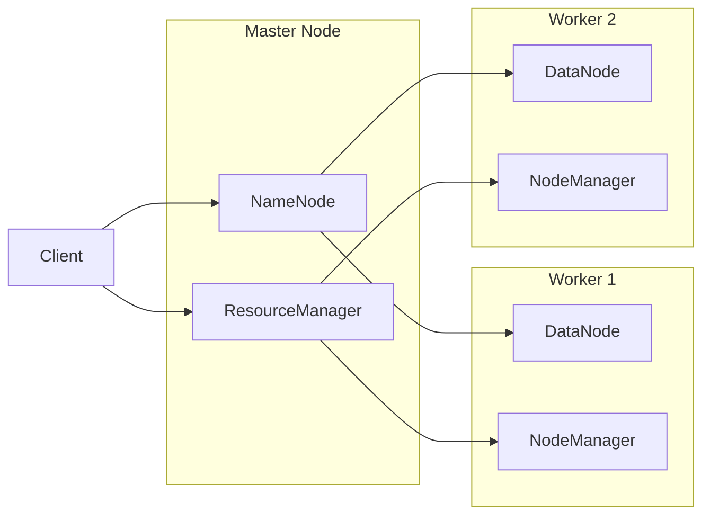
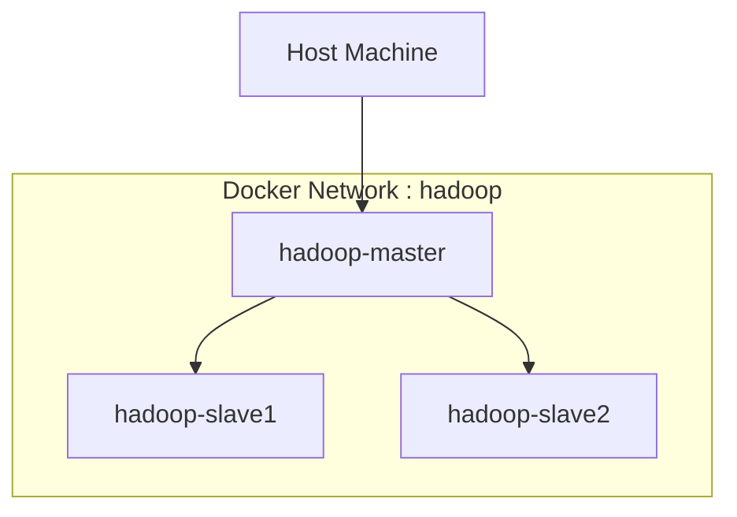
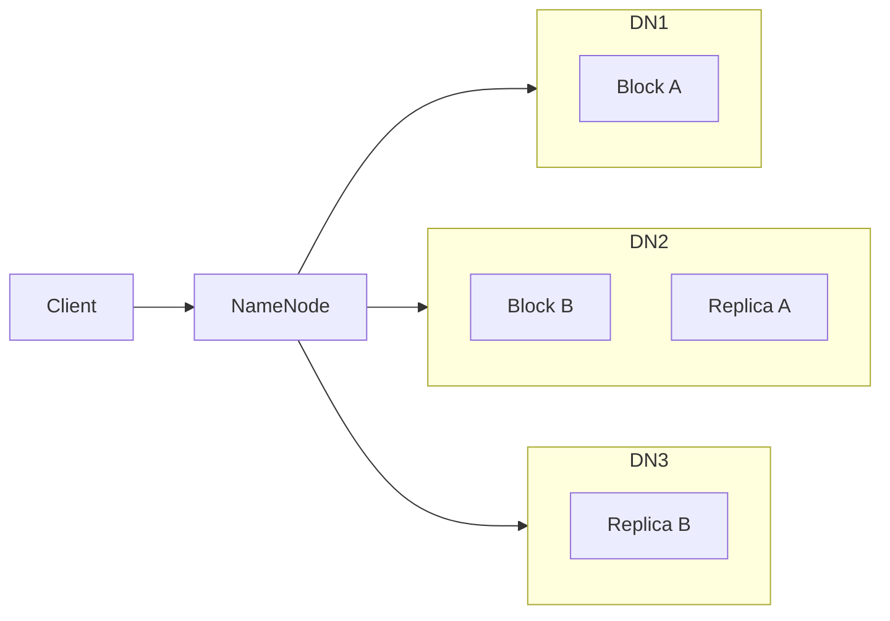
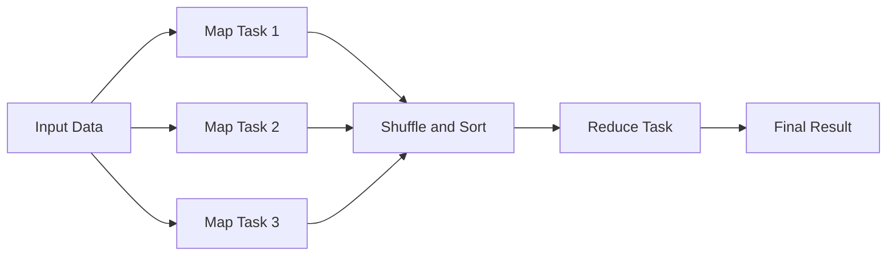

# Hadoop 3.4.3 Multi-Node Cluster with Docker


This project deploys a **modern Hadoop cluster (v3.4.3)** using **Docker containers** running on **Ubuntu 24.04 LTS**. The environment is designed for **learning distributed computing, HDFS, and MapReduce** on **Windows, macOS, or Linux**.

The setup simulates a real Hadoop cluster with:

* 1 **Master node** (NameNode + ResourceManager)
* Multiple **Worker nodes** (DataNode + NodeManager)
* SSH communication between nodes
* Fully functional **HDFS + YARN + MapReduce** stack

This repository is suitable for:

* Big Data practical labs
* Hadoop architecture learning
* Distributed systems training
* University teaching environments

---

# Table of Contents

1. Project Structure
2. Architecture Overview
3. HDFS Internal Architecture
4. MapReduce Execution Model
5. Prerequisites
6. Quick Start
7. Detailed Deployment
8. Docker Compose Alternative
9. Scalability
10. Hadoop Configuration Overview
11. Running a MapReduce Test
12. Web Interfaces
13. Troubleshooting
14. Educational Objectives

---

# 1. Project Structure

```
hadoop-tp/
├── Dockerfile
├── build-image.sh
├── start-container.sh
├── start-hadoop.sh
├── run-wordcount.sh
└── config/
    ├── core-site.xml
    ├── hdfs-site.xml
    ├── yarn-site.xml
    ├── mapred-site.xml
    ├── hadoop-env.sh
    ├── workers
    └── ssh_config
```

| File               | Purpose                                |
| ------------------ | -------------------------------------- |
| Dockerfile         | Builds the Hadoop container image      |
| build-image.sh     | Compiles the Docker image              |
| start-container.sh | Launches the Hadoop cluster containers |
| start-hadoop.sh    | Starts HDFS and YARN services          |
| run-wordcount.sh   | Executes a MapReduce test job          |
| config/            | Hadoop configuration files             |

---

# 2. Architecture Overview

## Logical Hadoop Architecture



## Docker Network Layout



---

# 3. HDFS Internal Architecture

HDFS stores files by splitting them into **blocks** which are distributed and replicated across DataNodes.



Example:

File.txt

Block A → DataNode1
Replica A → DataNode2

Block B → DataNode2
Replica B → DataNode3

Replication ensures **fault tolerance and data reliability**.

---

# 4. MapReduce Execution Model

A MapReduce job is executed in three main phases.



Execution pipeline:

1. Map phase processes input blocks
2. Shuffle redistributes intermediate keys
3. Reduce aggregates results

---

# 5. Prerequisites

Required software:

* Docker 20+
* Docker Desktop (Windows / macOS)
* Bash or WSL (Windows users)

Recommended resources:

* Minimum RAM: 4 GB
* Recommended RAM: 8 GB

Check Docker installation:

```
docker --version
```

---

# 6. Quick Start

## Clone the repository

```
git clone <repository-url>
cd hadoop-tp
```

## Create Docker network

```
docker network create --driver=bridge hadoop
```

## Build Hadoop image

```
chmod +x build-image.sh
./build-image.sh
```

## Start cluster

```
./start-container.sh 3
```

## Format HDFS (first run only)

```
hdfs namenode -format
```

## Start Hadoop services

```
start-hadoop.sh
```

---

# 7. Detailed Deployment

## Step 1 — Create Docker Network

```
docker network create --driver=bridge hadoop
```

## Step 2 — Build Docker Image

```
chmod +x build-image.sh
./build-image.sh
```

The image includes:

* Ubuntu 24.04
* OpenJDK 11
* Hadoop 3.4.3
* SSH configuration

## Step 3 — Launch Containers

```
./start-container.sh 3
```

Cluster nodes:

* hadoop-master
* hadoop-slave1
* hadoop-slave2

---

# 8. Docker Compose Alternative

Instead of manual container scripts, you can deploy the cluster using **Docker Compose**.

Example `docker-compose.yml`:

```
version: '3'

services:

  hadoop-master:
    image: hadoop-cluster
    hostname: hadoop-master
    container_name: hadoop-master
    networks:
      - hadoop

  hadoop-slave1:
    image: hadoop-cluster
    hostname: hadoop-slave1
    networks:
      - hadoop

  hadoop-slave2:
    image: hadoop-cluster
    hostname: hadoop-slave2
    networks:
      - hadoop

networks:
  hadoop:
    driver: bridge
```

Start the cluster:

```
docker compose up -d
```

Docker Compose simplifies orchestration and improves reproducibility for **teaching labs**.

---

# 9. Scalability

The cluster can scale horizontally by adding more worker nodes.

Example with 5 workers:

```
./start-container.sh 6
```

Cluster layout:

* 1 Master
* 5 Workers

To add workers manually:

1. Add new hostname in `workers`
2. Launch new container
3. Restart Hadoop services

Example:

```
hadoop-slave3
hadoop-slave4
```

This demonstrates Hadoop's **horizontal scalability**.

---

# 10. Hadoop Configuration Overview

## core-site.xml

```
hdfs://hadoop-master:9000
```

## hdfs-site.xml

```
dfs.replication = 2
```

## workers

```
hadoop-slave1
hadoop-slave2
```

---

# 11. Running a MapReduce Test

```
chmod +x run-wordcount.sh
./run-wordcount.sh
```

The script:

1. Generates text files
2. Uploads them to HDFS
3. Executes MapReduce example
4. Displays word count results

---

# 12. Web Interfaces

| Service               | URL                                            |
| --------------------- | ---------------------------------------------- |
| HDFS NameNode UI      | [http://localhost:9870](http://localhost:9870) |
| YARN Resource Manager | [http://localhost:8088](http://localhost:8088) |

These dashboards allow monitoring cluster activity.

---

# 13. Troubleshooting

| Problem          | Cause             | Solution             |
| ---------------- | ----------------- | -------------------- |
| Script errors    | CRLF line endings | Convert to LF        |
| Missing DataNode | Network conflict  | Check docker network |
| Container crash  | Insufficient RAM  | Allocate 4–8 GB      |

---

# 14. Educational Objectives

This project helps learners understand:

* Hadoop distributed architecture
* HDFS block storage
* MapReduce execution model
* YARN resource scheduling
* Containerized distributed systems

---

# Author

Zaid EL FID
IT Consultant and Big Data Instructor

2026
